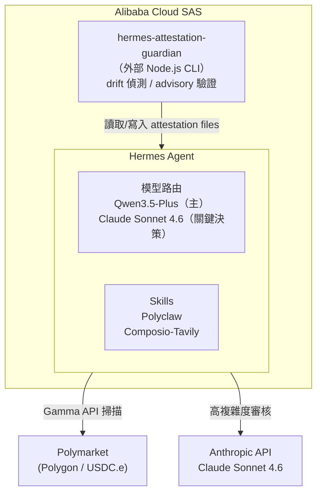
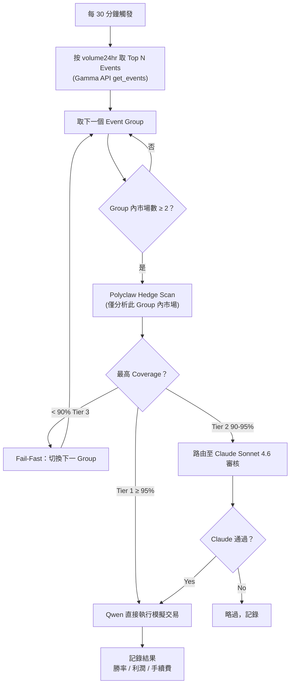
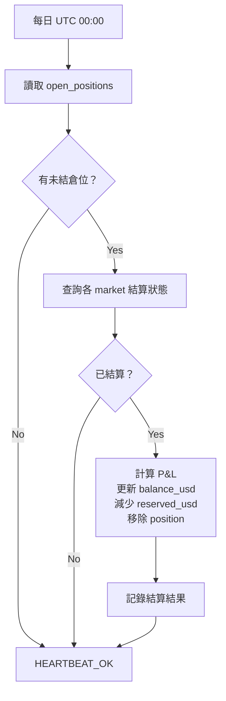

# 當前規格書

**最後更新**：2026-04-30  
**狀態**：Paper Trading 規劃階段

---

## 目標

在 Alibaba Cloud 部署 Hermes Agent，以百鍊 Qwen 為主模型、Claude 審核關鍵決策，透過 Polyclaw Hedge Scan 執行 Polymarket 邏輯套利（contrapositive / 數學套利），目標達成穩定被動收入。

---

## 背景限制

| 限制 | 說明 |
|------|------|
| Anthropic 政策（2026-04-04 起）| Hermes Agent 調用 Claude 時，必須走獨立 Anthropic API Key 按量計費，不能使用 Claude Pro/Max 訂閱額度 |
| Polymarket 升級 | 抵押品從 USDC.e 換為 Polymarket USD，Polyclaw 相容性需持續觀察 |
| 預算上限 | $200/月（運行成本）；$150 初始交易本金 |
| 本金說明 | $150 × 2-5% 月報酬 = $3-7.5/月，短期無法打平成本；初期定位為策略驗證 |

---

## 架構概覽



**資料流**：
1. Qwen 每 30 分鐘按 `volume24hr` 取 Top N Events（Gamma API `get_events`），逐一對 MarketGroup 執行 Hedge Scan；Group 內無 Tier 1/2 空間時立即 Fail-Fast 切換下一個 Group
2. 依 Tier 判定：Tier 1（≥95%）Qwen 直接執行；Tier 2（90-95%）路由 Claude 審核；Tier 3 略過
3. 通過審核 → Polyclaw 執行 on-chain 交易（Polygon）
4. hermes-attestation-guardian 外部監控 Hermes 環境完整性（attestation 驗證、config drift 偵測）

---

## 基礎建設

| 項目 | 規格 |
|------|------|
| 主機 | Alibaba Cloud SAS 通用型 swas.s.c2m4s50b1.linux（2 vCPU / 4 GiB / 50 GiB），英國（倫敦）或德國（法蘭克福）地域 |
| OS | Ubuntu 22.04 LTS |
| 部署方式 | Alibaba Cloud 官方 Hermes Agent 鏡像 |
| 儲存 | 20GB SSD |
| 網路 | 443 開放，SSH 透過 Tailscale，不暴露公網 |
| 啟動方式 | systemd daemon（自動重啟）；排程由 Hermes 內建管理 |

**環境變數**（透過 systemd `EnvironmentFile` 載入，檔案 `chmod 600`）：

```
ANTHROPIC_API_KEY       # Claude Sonnet 4.6
BAILIAN_API_KEY         # 百鍊 Qwen3.5-Plus
OPENROUTER_API_KEY      # Polyclaw hedge_scan 語義分析（nvidia/nemotron-nano-9b-v2:free）
POLYCLAW_PRIVATE_KEY    # 專用小額 Polygon 錢包（僅存放交易本金）
POLYCLAW_RPC_URL        # Chainstack 免費 RPC
CHAINSTACK_API_KEY      # Polyclaw 需要
```

---

## Hermes 配置摘要

**模型路由**（詳見 [ADR-001](adr/ADR-001-model-routing.md)）：
- 預設模型：`bailian/qwen3.5-plus`
- Tier 1（≥95% coverage）：Qwen 直接執行
- Tier 2（90–95% coverage）：路由至 Claude Sonnet 4.6 審核
- Tier 3（< 90%）：略過，僅記錄
- 其他觸發 Claude：`unusual market`、`error recovery`

**Skills 安裝順序**：
1. `polyclaw`（`~/.hermes/skills/polyclaw/`，uv 管理依賴）
2. `composio-tavily`（即時搜尋，詳見 [ADR-005](adr/ADR-005-composio-integration-hub.md)）
3. `hermes-attestation-guardian`（外部 Node.js CLI，獨立安裝，監控 Hermes 環境）

**Tier 2 Claude Sonnet 路由**：由 Hermes 原生 `delegate_task` 工具實現，無需安裝獨立 skill。設定於 `~/.hermes/config.yaml`：

```yaml
delegation:
  model: "anthropic/claude-sonnet-4-6"
  provider: "anthropic"
```

**Polyclaw 配置**：

| 參數 | 值 |
|------|-----|
| mode | `paper`（初始） |
| scan_interval_minutes | 30（paper）→ 視報告調整（實盤） |
| strategy | `hedge_scan` |
| tier_filter | Tier 1 執行；Tier 2 Claude 審核；Tier 3 略過 |
| max_position_usdc | 10 |
| daily_loss_limit_usdc | 5 |
| min_edge_pct | 5%（Kelly MIN_EDGE，低於此不執行） |
| max_fraction | 0.25（Quarter-Kelly，每筆最多壓注 25% Kelly 建議值） |
| heartbeat_interval_minutes | 15（無事時回傳 HEARTBEAT_OK，不消耗 token） |

Kelly Criterion 由 polyclaw 內建 Python 計算（確定性，非 LLM），整合於 `hedge scan` 輸出。bankroll 動態讀取：paper trading 從 `state/bankroll.json`，live trading 從錢包餘額。詳見 [ADR-006](adr/ADR-006-position-sizing.md)。

**安全設定**：
- Hermes command allowlist：高風險工具（exec、fs、trade）paper trading 期間設為 `ask: always`，實盤後改 `allow`

---

## 交易工作流程

### Paper Trading 階段（第 1-4 週）



### Bankroll 與結算機制

**適用範圍**：僅 Paper Trading 階段（實盤改讀錢包餘額）

**`state/bankroll.json` 結構**：
```json
{
  "balance_usd": 150.00,
  "reserved_usd": 0.00,
  "open_positions": []
}
```
- `balance_usd`：可用餘額
- `reserved_usd`：已部署資金（尚未結算）
- `open_positions`：未結倉位陣列（含 market_id、amount、entry_time 等）

**入場更新邏輯**（hedge_scan 執行後）：
1. 計算 `position_cost`（兩腿成本總和）
2. `balance_usd -= position_cost`
3. `reserved_usd += position_cost`
4. 新增 position 至 `open_positions`

**settle-check 每日結算流程**（UTC 00:00 cron）：



詳細設計見 [Bankroll Update Mechanism Design](docs/specs/2026-04-21-bankroll-update-mechanism-design.md)。

### NegRisk 市場支援

NegRisk 為 Polymarket 的互斥事件機制（同一事件的多個互斥結果）。Polyclaw 對 NegRisk 的支援分兩層：

- **識別層**：hedge_scan 將市場列表傳給 LLM（IMPLICATION_PROMPT），LLM 自然識別互斥結果間的邏輯必然性，無需專屬掃描選項；MarketGroup-based 掃描確保同一 NegRisk 事件的所有互斥結果自動被歸入同一批次，無需額外識別。
- **執行層**：`lib/contracts.py` 已定義 `NEG_RISK_CTF_EXCHANGE` 與 `NEG_RISK_ADAPTER` 合約地址；`lib/wallet_manager.py` 授權檢查已涵蓋 NegRisk 合約

可選：以 `--query "election"` 等關鍵字縮小掃描範圍，集中在特定事件類型。

### 進入實盤條件（需同時滿足，詳見 [ADR-004](adr/ADR-004-live-trading-criteria.md)）

- Paper trading 連續 2 週勝率 > 55%
- 平均每筆模擬利潤 > 手續費 2 倍
- 每筆模擬通過 Leg Risk 驗證：`budget ≤ min(YES側訂單簿深度, NO側訂單簿深度)`，滑價後仍符合最低獲利門檻
- hermes-attestation-guardian 未報告任何 drift 或安全異常

### 實盤風控

| 參數 | 值 |
|------|------|
| 單筆上限 | $10（本金 ~7%）|
| 每日虧損上限 | $5（觸發後當日停止）|
| 人工審查頻率 | 每週一次 log 檢查 |

---

## 成本預估

### Paper Trading 階段（Chainstack Developer 免費方案）

| 項目 | 每月估算 |
|------|---------|
| Alibaba Cloud SAS | $10-15 |
| 百鍊 Qwen API | $10-30 |
| Claude Sonnet API | $20-50 |
| Composio（Tavily 搜尋中樞） | $0-29 |
| Chainstack（Developer 免費） | $0 |
| **總計** | **$40-124** |

### 實盤階段（Chainstack Growth $49/月）

| 項目 | 每月估算 |
|------|---------|
| Alibaba Cloud SAS | $10-15 |
| 百鍊 Qwen API | $10-30 |
| Claude Sonnet API | $20-50 |
| Composio（Tavily 搜尋中樞） | $0-29 |
| Chainstack Growth | $49 |
| **總計** | **$89-173** |

預算上限 $200，兩情境均有空間應對用量波動。Chainstack 升級時機：paper trading 驗證穩定後，進入實盤前切換。Composio 免費層 20,000 tool calls/月，超量升級至 $29/月。

---

## 成功標準

| 時程 | 指標 |
|------|------|
| 第 1 個月 | 系統穩定運行，paper trading 策略可行 |
| 第 3 個月 | 實盤月報酬率 > 2%（覆蓋 Polygon gas） |
| 長期 | 確認策略有效後，考慮擴大本金至 $500-1000 |

---

## 已知風險

- Polymarket 升級（USDC.e → Polymarket USD）可能造成 Polyclaw 暫時不相容
- 套利利潤薄，手續費（0.3%-2%）+ 延遲可能吃掉利潤
- $150 本金短期內無法打平運行成本，需視為策略驗證投資
- UMA oracle 治理操控風險：Polymarket 使用 UMA 作為爭議解決機制，治理攻擊（如 2025-03 烏克蘭礦產案例）可能導致結果偏離市場預期。跨平台套利需 >$0.15 spread buffer，單一平台邏輯套利風險較低
- Leg Risk：hedge_scan 的兩腿（YES / NO）須同步執行；若一腿成交、另一腿失敗，將形成單邊曝險。Polyclaw 以 sub-5s 異步提交緩解，仍需於 log 中監控

---

## 待解決事項

- [x] `[2026-04-20]` `[resolved 2026-05-03]` — Embedding 市場去重：採用 Polymarket 原生 MarketGroup 分組替代（Top Volume Event-based 掃描）；ChromaDB 及相似度門檻方案明確否決；詳見 ADR-008
- [x] `[2026-04-20]` `[resolved 2026-04-21]` — Kelly Python calc 整合於 `hedge scan` 輸出，無需獨立 CLI；bankroll 動態讀取（paper: state file, live: wallet balance）；詳見 ADR-006
- [x] `[2026-04-27]` `[resolved 2026-04-28]` — Alibaba Cloud SAS 執行個體類型確定為通用型 swas.s.c2m4s50b1.linux（2c/4G），地域英國或德國；詳見 ADR-002
- [x] `[2026-04-27]` `[resolved 2026-04-30]` — `claude-code-skill` 等效方案確認：Tier 2 Claude Sonnet 路由由 Hermes 原生 `delegate_task` 處理（`~/.hermes/config.yaml` → `delegation.model: anthropic/claude-sonnet-4-6, provider: anthropic`）；官方 `claude-code` skill 存在但用於編程任務，非本專案所需；詳見 ADR-007

---

## YAGNI（明確不包含）

- Telegram / Discord 通知（驗證期不需要）
- Binance 自動橋接（$150 本金手動轉入即可）
- 多鏈支援
- 多策略並行（先驗證一個策略）
- Liquidity Provision / Market Making（需 $5,000+ 資金，超出簡單使用範圍）

---

## ADR 索引

| ADR | 決策主題 |
|-----|---------|
| [ADR-001](adr/ADR-001-model-routing.md) | 混合模型路由策略（Qwen 主 + Claude 審核） |
| [ADR-002](adr/ADR-002-deployment-platform.md) | 部署平台選擇（Alibaba Cloud SAS + Hermes Agent） |
| [ADR-003](adr/ADR-003-secret-management.md) | 私鑰與敏感變數安全管理 |
| [ADR-004](adr/ADR-004-live-trading-criteria.md) | Paper trading 進入實盤條件 |
| [ADR-005](adr/ADR-005-composio-integration-hub.md) | Composio 作為工具整合中樞（Tavily 搜尋） |
| [ADR-006](adr/ADR-006-position-sizing.md) | 倉位大小策略（Quarter-Kelly Python 計算） |
| [ADR-007](adr/ADR-007-agent-framework.md) | Agent 框架選擇（Hermes Agent 取代 OpenClaw） |
| [ADR-008](adr/ADR-008-hedge-scan-strategy.md) | Hedge Scan 市場選取與分組策略（Top Volume + MarketGroup + Fail-Fast） |
