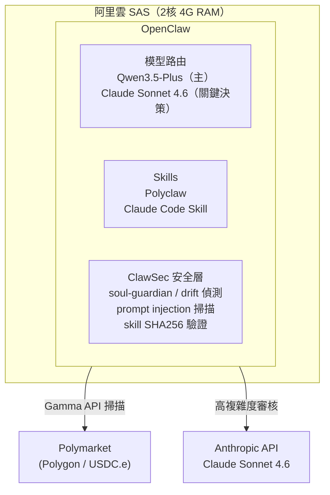
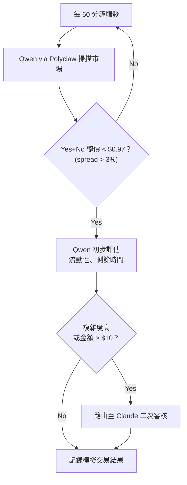

# TraderClaw — 當前規格書

**最後更新**：2026-04-12  
**狀態**：Paper Trading 規劃階段

---

## 目標

在阿里雲部署 OpenClaw，以百鍊 Qwen 為主模型、Claude 審核關鍵決策，透過 Polyclaw skill 執行 Polymarket Yes/No spread 套利，目標達成穩定被動收入。

---

## 背景限制

| 限制 | 說明 |
|------|------|
| Anthropic 政策（2026-04-04 起）| OpenClaw 不能使用 Claude Pro/Max 訂閱額度，必須走獨立 API Key 按量計費 |
| Polymarket 升級 | 抵押品從 USDC.e 換為 Polymarket USD，Polyclaw 相容性需持續觀察 |
| 預算上限 | $200/月（運行成本）；$100 初始交易本金 |
| 本金說明 | $100 × 2-5% 月報酬 = $2-5/月，短期無法打平成本；初期定位為策略驗證 |

---

## 架構概覽



**資料流**：
1. Qwen 每 60 分鐘透過 Polyclaw 掃描 Polymarket（Gamma API）
2. 發現套利機會 → Qwen 初步判斷
3. 高複雜度或高風險交易 → 路由至 Claude Sonnet 4.6 二次審核
4. 通過審核 → Polyclaw 執行 on-chain 交易（Polygon）
5. ClawSec 全程監控 SOUL.md 與 skill 完整性

---

## 基礎建設

| 項目 | 規格 |
|------|------|
| 主機 | 阿里雲 SAS 2核 4G RAM |
| OS | Ubuntu 22.04 LTS |
| 部署方式 | 阿里雲官方 OpenClaw 一鍵鏡像 |
| 儲存 | 20GB SSD |
| 網路 | 443 開放，SSH 透過 Tailscale，不暴露公網 |
| 啟動方式 | systemd daemon，自動重啟 |

**環境變數**（透過 systemd `EnvironmentFile` 載入，檔案 `chmod 600`）：

```
ANTHROPIC_API_KEY       # Claude Sonnet 4.6
BAILIAN_API_KEY         # 百鍊 Qwen3.5-Plus
POLYCLAW_PRIVATE_KEY    # 專用小額 Polygon 錢包（僅存放交易本金）
POLYCLAW_RPC_URL        # Chainstack 免費 RPC
CHAINSTACK_API_KEY      # Polyclaw 需要
```

---

## OpenClaw 配置摘要

**模型路由**（詳見 [ADR-001](adr/ADR-001-model-routing.md)）：
- 預設模型：`bailian/qwen3.5-plus`
- 觸發 Claude 審核條件：`hedge`、`arbitrage > $10`、`unusual market`、`error recovery`

**Skills 安裝順序**：
1. `polyclaw`
2. `claude-code-skill`
3. `composio-tavily`（即時搜尋，詳見 [ADR-005](adr/ADR-005-composio-integration-hub.md)）
4. `clawsec-suite`（最後安裝，確保前三者被納入監控）

**Polyclaw 配置**：

| 參數 | 值 |
|------|-----|
| mode | `paper`（初始） |
| scan_interval_minutes | 60 |
| strategy | `yes_no_spread` |
| max_position_usdc | 10 |
| daily_loss_limit_usdc | 5 |

**安全設定**：
- `sandbox.mode = "all"`
- 高風險工具（exec、fs、trade）：paper trading 期間 `ask: always`，實盤後改 `allow`

---

## 交易工作流程

### Paper Trading 階段（第 1-4 週）



### 進入實盤條件（需同時滿足，詳見 [ADR-004](adr/ADR-004-live-trading-criteria.md)）

- Paper trading 連續 2 週勝率 > 55%
- 平均每筆模擬利潤 > 手續費 2 倍
- ClawSec 未報告任何 drift 或安全異常

### 實盤風控

| 參數 | 值 |
|------|-----|
| 單筆上限 | $10（本金 10%）|
| 每日虧損上限 | $5（觸發後當日停止）|
| 人工審查頻率 | 每週一次 log 檢查 |

---

## 成本預估

| 項目 | 每月估算 |
|------|---------|
| 阿里雲 SAS | $10-15 |
| 百鍊 Qwen API | $10-30 |
| Claude Sonnet API | $20-50 |
| Composio（Tavily 搜尋中樞） | $0-29 |
| **總計** | **$40-124** |

預算上限 $200，有充裕空間應對用量波動。Composio 免費層 20,000 tool calls/月，超量升級至 $29/月。

---

## 成功標準

| 時程 | 指標 |
|------|------|
| 第 1 個月 | 系統穩定運行，paper trading 策略可行 |
| 第 3 個月 | 實盤月報酬率 > 2%（覆蓋 Polygon gas） |
| 長期 | 確認策略有效後，考慮擴大本金至 $500-1000 |

---

## 已知風險

- Polymarket 升級（USDC.e → Polymarket USD）可能造成 Polyclaw 暫時不相容
- 套利利潤薄，手續費（0.3%-2%）+ 延遲可能吃掉利潤
- $100 本金短期內無法打平運行成本，需視為策略驗證投資

---

## YAGNI（明確不包含）

- Telegram / Discord 通知（驗證期不需要）
- Binance 自動橋接（$100 本金手動轉入即可）
- 多鏈支援
- 多策略並行（先驗證一個策略）

---

## ADR 索引

| ADR | 決策主題 |
|-----|---------|
| [ADR-001](adr/ADR-001-model-routing.md) | 混合模型路由策略（Qwen 主 + Claude 審核） |
| [ADR-002](adr/ADR-002-deployment-platform.md) | 部署平台選擇（阿里雲 SAS + systemd） |
| [ADR-003](adr/ADR-003-secret-management.md) | 私鑰與敏感變數安全管理 |
| [ADR-004](adr/ADR-004-live-trading-criteria.md) | Paper trading 進入實盤條件 |
| [ADR-005](adr/ADR-005-composio-integration-hub.md) | Composio 作為工具整合中樞（Tavily 搜尋） |
