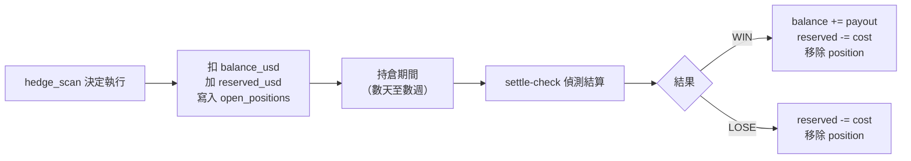
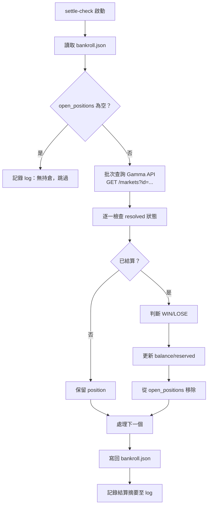
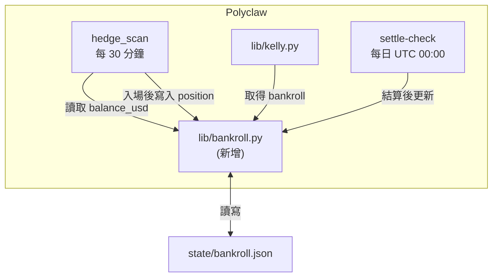

# Bankroll 更新機制設計

**日期**：2026-04-21  
**狀態**：Approved

---

## 概述

定義 `state/bankroll.json` 的更新機制，支援 paper trading 階段的持倉追蹤與結算。

**適用範圍**：僅 paper trading 模式。Live trading 時 bankroll 從錢包餘額讀取（見 ADR-006），不使用此檔案與 settle-check 機制。

## 設計決策

| 決策點 | 選擇 | 理由 |
|--------|------|------|
| 更新觸發 | 每筆交易結算後 | Kelly 依賴準確 bankroll |
| 結算時機 | 模擬真實結算 | 追蹤持倉，市場 resolve 時更新 |
| 資料結構 | 單一檔案（餘額 + 持倉） | 簡化管理，單一來源 |
| 結算偵測 | 獨立 cron job | 與 hedge_scan 解耦 |
| 檢查頻率 | 每日一次（UTC 00:00） | 省資源，延遲影響小 |
| 實作方式 | Polyclaw 原生整合 | 邏輯內聚，複用現有 Gamma API |
| 數學計算 | Python 確定性計算 | 所有財務運算（Kelly、P&L、結算）由 Python 執行，LLM 不參與計算 |

---

## 資料結構

### `state/bankroll.json`

```json
{
  "balance_usd": 150.0,
  "reserved_usd": 0.0,
  "open_positions": []
}
```

| 欄位 | 說明 |
|------|------|
| `balance_usd` | 可用餘額（扣除已入場成本後） |
| `reserved_usd` | 已入場但未結算的總成本 |
| `open_positions` | 未結算持倉陣列 |

### Position 結構

```json
{
  "market_id": "0x1234...",
  "condition_id": "0xabcd...",
  "entry_timestamp": "2026-04-21T10:30:00Z",
  "cost_usd": 8.50,
  "expected_payout_usd": 10.0,
  "side": "YES",
  "kelly": {
    "f_star": 0.142,
    "coverage": 0.962,
    "edge_pct": 7.8,
    "bankroll_at_entry": 150.0,
    "raw_position_usd": 5.33,
    "final_position_usd": 5.33,
    "capped": false
  },
  "notes": "Tier 1"
}
```

### Kelly 欄位說明

| 欄位 | 用途 |
|------|------|
| `f_star` | 原始 Kelly 分數 |
| `coverage` | 當時的成功機率估算 |
| `edge_pct` | 邊際利潤 % |
| `bankroll_at_entry` | 入場時的 bankroll |
| `raw_position_usd` | Quarter-Kelly 計算結果 |
| `final_position_usd` | 套用上限後實際倉位 |
| `capped` | 是否觸發 $10 上限 |

---

## 持倉生命週期



### 入場（hedge_scan 執行交易後）

1. `balance_usd -= cost_usd`
2. `reserved_usd += cost_usd`
3. 新增 position 到 `open_positions[]`

### 結算（settle-check 偵測到 resolved）

- **WIN**：`balance_usd += expected_payout_usd`，`reserved_usd -= cost_usd`，移除 position
- **LOSE**：`reserved_usd -= cost_usd`，移除 position

### 驗算

任何時刻：`balance_usd + reserved_usd` = 總資產淨值

---

## settle-check 流程

**觸發方式**：systemd timer，每日 UTC 00:00



### Gamma API 查詢

- 單次 batch 查詢所有持倉的 market_id
- 回傳包含 `resolved: true/false` 與 `outcome` 欄位

### 勝負判定

- 若 `market.outcome` == position `side`（YES/NO）→ WIN
- 否則 → LOSE

### Log 輸出

`logs/settle_check.jsonl`：

```json
{"timestamp": "2026-04-22T00:00:05Z", "checked": 3, "settled": 1, "win": 1, "lose": 0, "pnl_usd": 1.50}
```

---

## 錯誤處理

| 情境 | 處理方式 |
|------|----------|
| `bankroll.json` 不存在 | 初次啟動時自動建立，`balance_usd` = $150，`reserved_usd` = 0，`open_positions` = [] |
| `bankroll.json` 格式損壞 | settle-check 中止，寫 error log，不覆寫檔案；等人工修復 |
| Gamma API 查詢失敗 | 重試 3 次（間隔 5 秒），全失敗則中止本次 settle-check，下次排程再試 |
| 單一 market 查詢異常 | 跳過該 position，繼續處理其他；log 記錄異常 market_id |
| 寫入 bankroll.json 失敗 | 中止，log error；檔案維持原狀 |

### 原子寫入

1. 先寫入 `bankroll.json.tmp`
2. 成功後 `rename` 覆蓋原檔（避免寫到一半斷電導致檔案損壞）

---

## 系統整合



### 新增檔案

| 檔案 | 職責 |
|------|------|
| `lib/bankroll.py` | 讀寫 `bankroll.json`、position CRUD、結算計算 |
| `cli/settle_check.py` | `polyclaw settle-check` 指令進入點 |

### 修改檔案

| 檔案 | 改動 |
|------|------|
| `lib/kelly.py` | 改從 `bankroll.py` 取得 bankroll，取代直接讀 JSON |
| `hedge_scan` | 執行交易後呼叫 `bankroll.add_position()` |

### systemd 設定

```ini
# /etc/systemd/system/polyclaw-settle.timer
[Timer]
OnCalendar=*-*-* 00:00:00 UTC
Persistent=true

[Install]
WantedBy=timers.target
```

```ini
# /etc/systemd/system/polyclaw-settle.service
[Service]
ExecStart=/path/to/polyclaw settle-check
EnvironmentFile=/etc/polyclaw/env
```

---

## Kelly 計算整合

Kelly 計算時讀取 `balance_usd`（不含 `reserved_usd`），確保不會用已押注資金再算倉位。

---

## 事後分析用途

記錄 Kelly 參數支援 paper trading 驗證：

- 比對 `coverage` vs 實際勝率 → 校正機率估算
- 檢視 `capped` 頻率 → 判斷上限是否過緊
- 追蹤 `bankroll_at_entry` 變化 → 分析資金成長曲線
